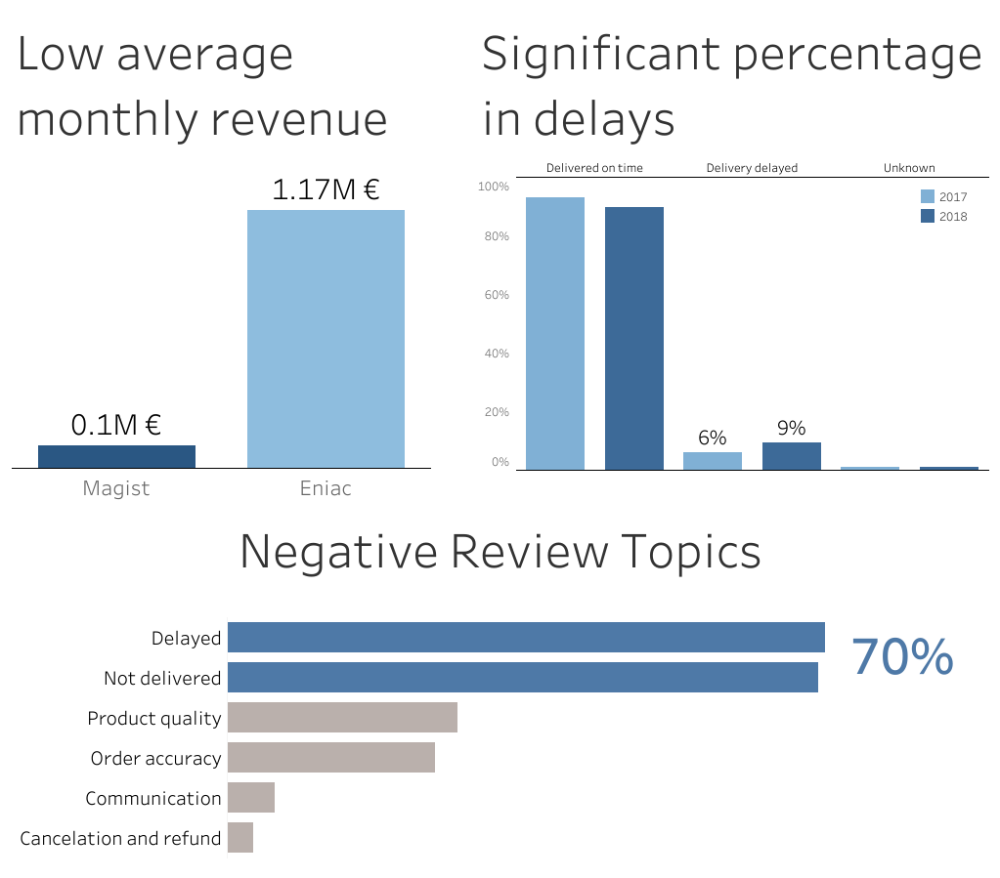

# Magist Data Analysis and Visualization

Case study: Data analysis and visualization to evaluate and recommend a business partnership. Team project for data-driven business with SQL and Tableau.

## Project

Eniac is a online marketplace specializing in Apple-compatible accessories. To enter the Brazilian market, Eniac is considering a partnership with Magist, a Brazilian company that offers a centralized order management system to connect small and medium-sized stores with the biggest Brazilian marketplaces.

To help Eniac make an educated decision, two questions are at the core of this project.

1. Is Magist a good partner for high-end tech products?
2. Is Magist's delivery service fast enough?

We found that Magist represents a small tech sector and provides delivery services subpar to Eniac's expectations. Based on the provided data, we therefore do not recommend Magist as a partner at this time.

> [!TIP]
> Click on the preview to interact with the published Tableau dashboard

## Languages and libraries used

- SQL (with MySQL)
- Tableau Public

## Key learning

- Explore the undocumented relational database describing Magist's services
- Join and query the database tables to extract and filter relevant information about Magist's performance
- Agree on various approaches and divide the tasks among the team
- Clean the data and identify outliers
- Visualize the key findings using Tableau
- Research the Brazilian market and put the data into context
- Compile the insights across team members in a cohesive way to reach a conclusion
- Present the findings and make a recommendation for Eniac

## Challenges overcome

- Understanding the undocumented database
- Establishing a definition for high-tech products based on product categories
- Working with a data in a foreign language (specifically customer reviews in Portuguese)
- Identifying the strongest findings and stripping irrelevant insights
- Presenting the results in a concise manner to meet time restrictions

## Resources

### Analytics

- [Schema.pdf](Schema.pdf) - Schema of the relational database
- [Revenue.sql](Revenue.sql) - Query to extract the revenue information
- [Delivery.sql](Delivery.sql) - Query to extract the delivery times
- [Reviews.sql](Reviews.sql) - Query to extract the customer complaints

### Visualization

- [MagistAnalysis.twbx](MagistAnalysis.twbx) - Tableau Public Dashboard
- [Published Tableau Public Dashboard](https://public.tableau.com/views/MagistAnalysis_17146788675680/Recommendation)
- [Presentation.pdf](Presentation.pdf) - Project presentation including the final recommendation

Tableau Public Dashboard link  
https://public.tableau.com/views/MagistAnalysis_17146788675680/Recommendation
